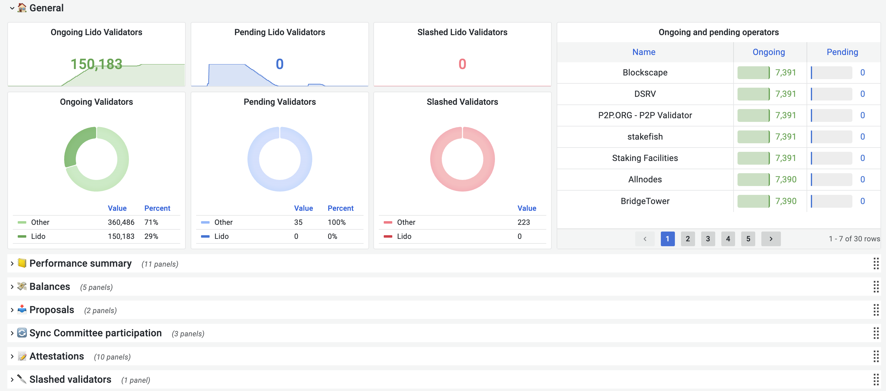
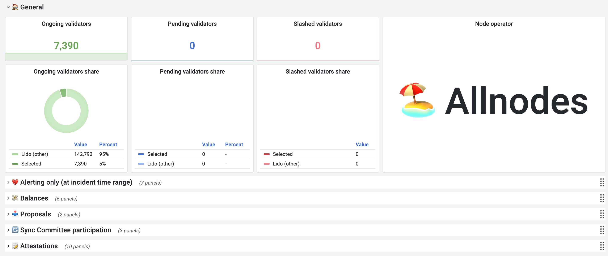
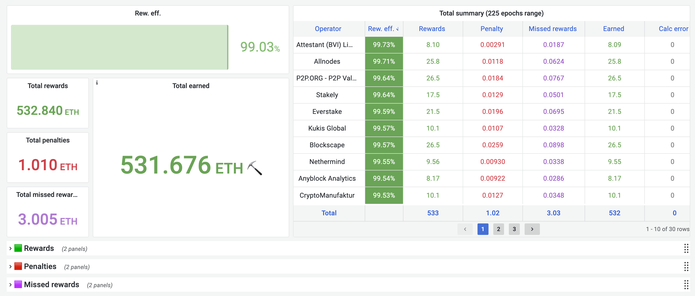

# 🐢 ethereum-validators-monitoring (aka balval)

Consensus layer validators monitoring bot, that fetches Lido or Custom Users Node Operators keys
from Execution layer and checks their performance in Consensus
layer by: balance delta, attestations, proposes, sync committee participation.

Bot has two separate working modes: `finalized` and `head` for fetching validator info,
writes data to **Clickhouse**, displays aggregates by **Grafana**
dashboard, alerts about bad performance by **Prometheus + Alertmanger** and
routes notifications to Discord channel via **alertmanager-discord**.

## Working modes

You can switch working mode by providing `WORKING_MODE` environment variable with one of the following values:

### `finalized`
Default working mode. The service will fetch validators info from finalized states (the latest finalized epoch is 2 epochs back from `head`).
It is more stable and reliable because all data is already finalized.

**Pros**:
* No errors due to reorgs
* Less rewards calculation errors
* Accurate data in alerts and dashboard

**Cons**:
* 2 epochs delay in processing and critical alerts will be given with 2 epochs delay
* In case of long finality the app will not monitor and will wait for the finality

### `head`
Alternative working mode. The service will fetch validators info from non-finalized states.
It is less stable and reliable because of data is not finalized yet. There can be some calculation errors because of reorgs.

**Pros**:
* Less delay in processing and critical alerts will be given with less delay
* In case of long finality the app will monitor and will not wait for the finality

**Cons**:
* Errors due to reorgs
* More rewards calculation errors
* Possible inaccurate data in alerts and dashboard

## Dashboards

There are three dashboards in Grafana:
* **Validators** - shows aggregated data about performance for all monitored validators

* **NodeOperator** - shows aggregated data about performance for each monitored node operator

* **Rewards & Penalties** - shows aggregated data about rewards, penalties, and missed rewards for each monitored node operator


## Alerts

There are several default alerts which are triggered by Prometheus rules:

* General:
  * 🔪 Slashed validators
  * 💸 Operators with negative balance delta
* Proposals:
  * 📥 Operators with missed block propose
  * 📈📥 Operators with missed block propose (on possible high reward validators)
* Sync:
  * 🔄 Operators with bad sync participation
  * 📈🔄 Operators with bad sync participation (on possible high reward validators)
* Attestations:
  * 📝❌ Operators with missed attestation
  * 📝🐢 Operators with high inc. delay attestation
  * 📝🏷️ Operators with two invalid attestation property (head/target/source)
  * 📈📝❌ Operators with missed attestation (on possible high reward validators)

## First run

You have two options to run this application: `docker-compose` or `node`
and two sources of validator list: `lido` (by default) or `file` (see [here](#use-custom-validators-list)).

Because Lido contract on `mainnet` contains a lot of validators,
fetching and saving them to local storage can take time (depends on your EL RPC host) and a lot of RAM.
For avoiding `heap out of memory` error, you can pass `NODE_OPTIONS` env var with `--max-old-space-size=8192` value
and when the application completes its first cycle, you can restart your instance without this env variable.

## Run via docker-compose

1. Use `.env.example` file content to create your own `.env` file
2. Build app image via `docker-compose build app`
3. Set owner for validators registry sources
```bash
chown -R 1000:1000 ./docker/validators
```
4. Create `.volumes` directory from `docker` directory:
```bash
cp -r docker .volumes
chown -R 65534:65534 .volumes/prometheus
chown -R 65534:65534 .volumes/alertmanager
chown -R 472:472 .volumes/grafana
```
5. Run `docker-compose up -d`
6. Open Grafana UI at `http://localhost:8082/`
   (login: `admin`, password: `MYPASSWORT`) and wait
   first app cycle execution for display data

## Run via node

1. Install dependencies via `yarn install`
2. Run `yarn build`
3. Tweak `.env` file from `.env.example`
4. Run Clickhouse to use as bot DB
```bash
docker-compose up -d clickhouse
```
5. Change `DB_HOST` value to `http://localhost`
6. Set owner for validators registry sources
```bash
chown -R 1000:1000 ./docker/validators
```
7. Run `yarn start:prod`

## Use custom validators list

By default, monitoring bot fetches validator keys from Lido contract, but you can monitor your own validators:
1. Set `VALIDATOR_REGISTRY_SOURCE` env var to `file`
2. Create file with keys by example [here](docker/validators/custom_mainnet.yaml)
3. Set `VALIDATOR_REGISTRY_FILE_SOURCE_PATH` env var to `<path to your file>`

If you want to implement your own source, it must match [RegistrySource interface](src/validators-registry/registry-source.interface.ts) and be included in [RegistryModule providers](src/validators-registry/registry.module.ts)

## Clickhouse data retention

By default, storage keep the data with `Inf.` time to live.
It can be changed by the TTL policy for Clickhouse:
```
# goerli
ALTER TABLE validators_summary MODIFY TTL toDateTime(1616508000 + (epoch * 32 * 12)) + INTERVAL 3 MONTH;

# mainnet
ALTER TABLE validators_summary MODIFY TTL toDateTime(1606824023 + (epoch * 32 * 12)) + INTERVAL 3 MONTH;
```

## Application Env variables

---
`LOG_LEVEL` - Application log level
* **Required:** false
* **Default:** info
---
`LOG_FORMAT` - Application log format (simple or json)
* **Required:** false
* **Default:** json
---
`WORKING_MODE` - Application working mode (finalized or head)
* **Required:** false
* **Default:** finalized
---
`DB_HOST` - Clickhouse server host
* **Required:** true
---
`DB_USER` - Clickhouse server user
* **Required:** true
---
`DB_PASSWORD` - Clickhouse server password
* **Required:** true
---
`DB_NAME` - Clickhouse server DB name
* **Required:** true
---
`DB_PORT` - Clickhouse server port
* **Required:** false
* **Default:** 8123
---
`HTTP_PORT` - Port for Prometheus HTTP server in application on the container (Note: if you change this, also update it in [prometheus.yml](docker/prometheus/prometheus.yml))
* **Required:** false
* **Default:** 8080
---
`EXTERNAL_HTTP_PORT` - Port for Prometheus HTTP server in application that is exposed to the host
* **Required:** false
* **Default:** `HTTP_PORT`
---
`DB_MAX_RETRIES` - Max retries for each query to DB
* **Required:** false
* **Default:** 10
---
`DB_MIN_BACKOFF_SEC` - Min backoff for DB query retrier
* **Required:** false
* **Default:** 1
---
`DB_MAX_BACKOFF_SEC` - Min backoff for DB query retrier
* **Required:** false
* **Default:** 120
---
`DRY_RUN` - Run application in dry mode. This means that it runs a main cycle once every 24 hours
* **Required:** false
* **Default:** false
---
`ETH_NETWORK` - Ethereum network ID for connection execution layer RPC
* **Required:** true
---
`EL_RPC_URLS` - Ethereum execution layer comma separated RPC urls
* **Required:** true
---
`CL_API_URLS` - Ethereum consensus layer comma separated API urls
* **Required:** true
---
`CL_API_RETRY_DELAY_MS` - Ethereum consensus layer request retry delay
* **Required:** false
* **Default:** 500
---
`CL_API_GET_RESPONSE_TIMEOUT` - Ethereum consensus layer GET response (header) timeout (ms)
* **Required:** false
* **Default:** 15000
---
`CL_API_MAX_RETRIES` - Ethereum consensus layer max retries for all requests
* **Required:** false
* **Default:** 1 (means that request will be executed once)
---
`CL_API_GET_BLOCK_INFO_MAX_RETRIES` - Ethereum consensus layer max retries for fetching block info. Independent of `CL_API_MAX_RETRIES`
* **Required:** false
* **Default:** 1 (means that request will be executed once)
---
`FETCH_INTERVAL_SLOTS` - Count of slots in Ethereum consensus layer epoch
* **Required:** false
* **Default:** 32
---
`CHAIN_SLOT_TIME_SECONDS` - Ethereum consensus layer time slot size (sec)
* **Required:** false
* **Default:** 12
---
`START_EPOCH` - Ethereum consensus layer epoch for start application
* **Required:** false
* **Default:** 155000
---
`VALIDATOR_REGISTRY_SOURCE` - Validators registry source. Possible values: `lido` (Lido NodeOperatorsRegistry module keys), `keysapi` (Lido keys from multiple modules), `file`
* **Required:** false
* **Default:** lido
---
`VALIDATOR_REGISTRY_FILE_SOURCE_PATH` - Validators registry file source path. It makes sense to change default value if you set `VALIDATOR_REGISTRY_SOURCE` to `file`
* **Required:** false
* **Default:** ./docker/validators/custom_mainnet.yaml
---
`VALIDATOR_REGISTRY_LIDO_SOURCE_SQLITE_CACHE_PATH` - Validators registry lido source sqlite cache path. It makes sense to change default value if you set `VALIDATOR_REGISTRY_SOURCE` to `lido`
* **Required:** false
* **Default:** ./docker/validators/lido_mainnet.db
---
`VALIDATOR_USE_STUCK_KEYS_FILE` - Use a file with list of validators that are stuck and should be excluded from the monitoring metrics
* **Required:** false
* **Default:** false
---
`VALIDATOR_STUCK_KEYS_FILE_PATH` - Path to file with list of validators that are stuck and should be excluded from the monitoring metrics
* **Required:** false
* **Default:** ./docker/validators/stuck_keys.yaml
* **Note:** will be used only if `VALIDATOR_USE_STUCK_KEYS_FILE` is true
---
`SYNC_PARTICIPATION_DISTANCE_DOWN_FROM_CHAIN_AVG` - Distance (down) from Blockchain Sync Participation average after which we think that our sync participation is bad
* **Required:** false
* **Default:** 0
---
`SYNC_PARTICIPATION_EPOCHS_LESS_THAN_CHAIN_AVG` - Number epochs after which we think that our sync participation is bad and alert about that
* **Required:** false
* **Default:** 3
---
`BAD_ATTESTATION_EPOCHS` - Number epochs after which we think that our attestation is bad and alert about that
* **Required:** false
* **Default:** 3
---
`CRITICAL_ALERTS_ALERTMANAGER_URL` - If passed, application sends additional critical alerts about validators performance to Alertmanager
* **Required:** false
---
`CRITICAL_ALERTS_MIN_VAL_COUNT` - Critical alerts will be sent for Node Operators with validators count greater this value
* **Required:** false
---
`CRITICAL_ALERTS_ALERTMANAGER_LABELS` - Additional labels for critical alerts. Must be in JSON string format. Example - '{"a":"valueA","b":"valueB"}'
* **Required:** false
---

## Application critical alerts (via Alertmanager)

In addition to alerts based on Prometheus metrics you can receive special critical alerts based on beaconchain aggregates from app.

You should pass env var `CRITICAL_ALERTS_ALERTMANAGER_URL=http://<alertmanager_host>:<alertmanager_port>`.

And if `ethereum_validators_monitoring_data_actuality < 1h` it allows you to receive alerts from table bellow

| Alert name                 | Description                                                                                                     | If fired repeat | If value increased repeat |
|----------------------------|-----------------------------------------------------------------------------------------------------------------|-----------------|---------------------------|
| CriticalSlashing           | At least one validator was slashed                                                                              | instant         | -                         |
| CriticalMissedProposes     | More than 1/3 blocks from Node Operator duties was missed in the last 12 hours                                  | every 6h        | -                         |
| CriticalNegativeDelta      | More than 1/3 Node Operator validators with negative balance delta (between current and 6 epochs ago)           | every 6h        | every 1h                  |
| CriticalMissedAttestations | More than 1/3 Node Operator validators with missed attestations in the last {{ BAD_ATTESTATION_EPOCHS }} epochs | every 6h        | every 1h                  |


## Application metrics

**WARNING: all metrics are prefixed with `ethereum_validators_monitoring_`**

| Metric                                                                    | Labels                           | Description                                                                                                                                                                                  |
|---------------------------------------------------------------------------|----------------------------------|----------------------------------------------------------------------------------------------------------------------------------------------------------------------------------------------|
| validators                                                                | owner, status                    | Count of validators in chain                                                                                                                                                                 |
| user_validators                                                           | nos_name, status                 | Count of validators for each user Node Operator                                                                                                                                              |
| data_actuality                                                            |                                  | Application data actuality in ms                                                                                                                                                             |
| fetch_interval                                                            |                                  | The same as `FETCH_INTERVAL_SLOTS`                                                                                                                                                           |
| sync_participation_distance_down_from_chain_avg                           |                                  | The same as `SYNC_PARTICIPATION_DISTANCE_DOWN_FROM_CHAIN_AVG`                                                                                                                                |
| epoch_number                                                              |                                  | Current epoch number in app work process                                                                                                                                                     |
| contract_keys_total                                                       |                                  | Total user validators keys                                                                                                                                                                   |
| steth_buffered_ether_total                                                |                                  | Buffered Ether (ETH) in Lido contract                                                                                                                                                        |
| total_balance_24h_difference                                              |                                  | Total user validators balance difference (24 hours)                                                                                                                                          |
| validator_balances_delta                                                  | nos_name                         | Validators balance delta for each user Node Operator                                                                                                                                         |
| validator_quantile_001_balances_delta                                     | nos_name                         | Validators 0.1% quantile balances delta for each user Node Operator                                                                                                                          |
| validator_count_with_negative_balances_delta                              | nos_name                         | Number of validators with negative balances delta for each user Node Operator                                                                                                                |
| validator_count_with_sync_participation_less_avg                          | nos_name                         | Number of validators with sync committee participation less avg for each user Node Operator                                                                                                  |
| validator_count_miss_attestation                                          | nos_name                         | Number of validators miss attestation for each user Node Operator                                                                                                                            |
| validator_count_invalid_attestation                                       | nos_name, reason                 | Number of validators with invalid properties (head, target, source) \ high inc. delay in attestation for each user Node Operator                                                             |
| validator_count_invalid_attestation_last_n_epoch                          | nos_name, reason, epoch_interval | Number of validators with invalid properties (head, target, source) \ high inc. delay in attestation last `BAD_ATTESTATION_EPOCHS` epoch for each user Node Operator                         |
| validator_count_miss_attestation_last_n_epoch                             | nos_name, epoch_interval         | Number of validators miss attestation last `BAD_ATTESTATION_EPOCHS` epoch for each user Node Operator                                                                                        |
| validator_count_high_inc_delay_last_n_epoch                               | nos_name, epoch_interval         | Number of validators with inc. delay > 2 last N epochs for each user Node Operator                                                                                                           |
| validator_count_invalid_attestation_property_last_n_epoch                 | nos_name, epoch_interval         | Number of validators with two invalid attestation property (head or target or source) last N epochs for each user Node Operator                                                              |
| high_reward_validator_count_miss_attestation_last_n_epoch                 | nos_name, epoch_interval         | Number of validators miss attestation last `BAD_ATTESTATION_EPOCHS` epoch  (with possible high reward in the future) for each user Node Operator                                             |
| validator_count_with_sync_participation_less_avg_last_n_epoch             | nos_name, epoch_interval         | Number of validators with sync participation less than avg last `SYNC_PARTICIPATION_EPOCHS_LESS_THAN_CHAIN_AVG` epoch for each user Node Operator                                            |
| high_reward_validator_count_with_sync_participation_less_avg_last_n_epoch | nos_name, epoch_interval         | Number of validators with sync participation less than avg last `SYNC_PARTICIPATION_EPOCHS_LESS_THAN_CHAIN_AVG` epoch  (with possible high reward in the future) for each user Node Operator |
| validator_count_miss_propose                                              | nos_name                         | Number of validators miss propose for each user Node Operator                                                                                                                                |
| high_reward_validator_count_miss_propose                                  | nos_name                         | Number of validators miss propose (with possible high reward in the future)                                                                                                                  |
| user_sync_participation_avg_percent                                       |                                  | User sync committee validators participation avg percent                                                                                                                                     |
| chain_sync_participation_avg_percent                                      |                                  | All sync committee validators participation avg percent                                                                                                                                      |
| operator_real_balance_delta                                               | nos_name                         | Real operator balance change. Between N and N-1 epochs                                                                                                                                       |
| operator_calculated_balance_delta                                         | nos_name                         | Calculated operator balance change based on rewards calculation                                                                                                                              |
| operator_calculated_balance_calculation_error                             | nos_name                         | Diff between calculated and real balance change                                                                                                                                              |
| avg_chain_reward                                                          | duty                             | Average validator's reward for each duty                                                                                                                                                     |
| operator_reward                                                           | nos_name, duty                   | Operator's reward for each duty                                                                                                                                                              |
| avg_chain_missed_reward                                                   | duty                             | Average validator's missed reward for each duty                                                                                                                                              |
| operator_missed_reward                                                    | nos_name, duty                   | Operator's missed reward for each duty                                                                                                                                                       |
| avg_chain_penalty                                                         | duty                             | Average validator's penalty for each duty                                                                                                                                                    |
| operator_penalty                                                          | nos_name, duty                   | Operator's penalty for each duty                                                                                                                                                             |


## Release flow

To create new release:

1. Merge all changes to the `master` branch
1. Navigate to Repo => Actions
1. Run action "Prepare release" action against `master` branch
1. When action execution is finished, navigate to Repo => Pull requests
1. Find pull request named "chore(release): X.X.X" review and merge it with "Rebase and merge" (or "Squash and merge")
1. After merge release action will be triggered automatically
1. Navigate to Repo => Actions and see last actions logs for further details
